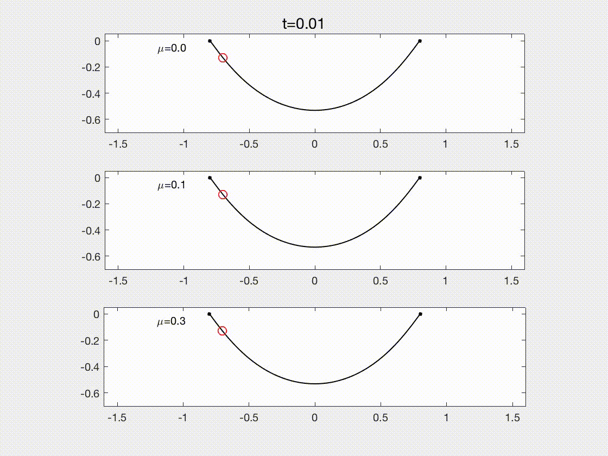
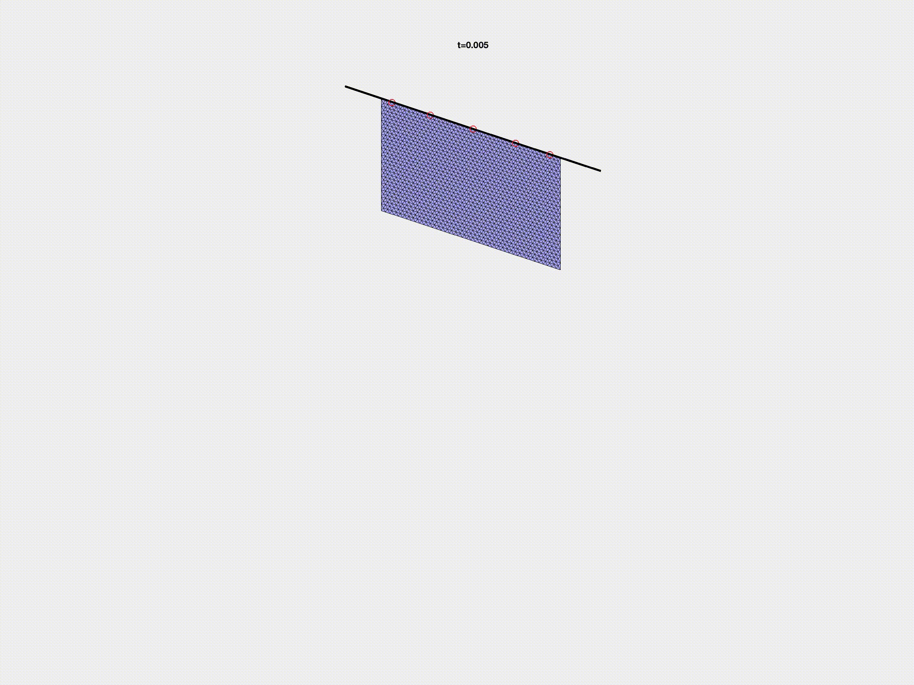

# Dynamic modeling of a sliding ring on an elastic rod

# Overview

Dynamic modeling of a sliding ring on an elastic rod.

 

 

To run this code, you should have a Linux Ubuntu system

# Make

source /opt/intel/oneapi/setvars.sh

g++ -I /usr/local/include/eigen-3.3.7/ main.cpp world.cpp setInput.cpp timeStepper.cpp inertialForce.cpp externalGravityForce.cpp dampingForce.cpp elasticStretchingForce.cpp elasticBendingForce.cpp elasticPlate.cpp externalContactForce.cpp -lGL -lglut -lGLU -L${MKLROOT}/lib/intel64 -Wl,--no-as-needed -lmkl_intel_lp64 -lmkl_intel_thread -lmkl_core -liomp5 -llapack -lgfortran -fopenmp -lpthread -lm -Ofast -o simDER

# Run 

./simDER option.txt
